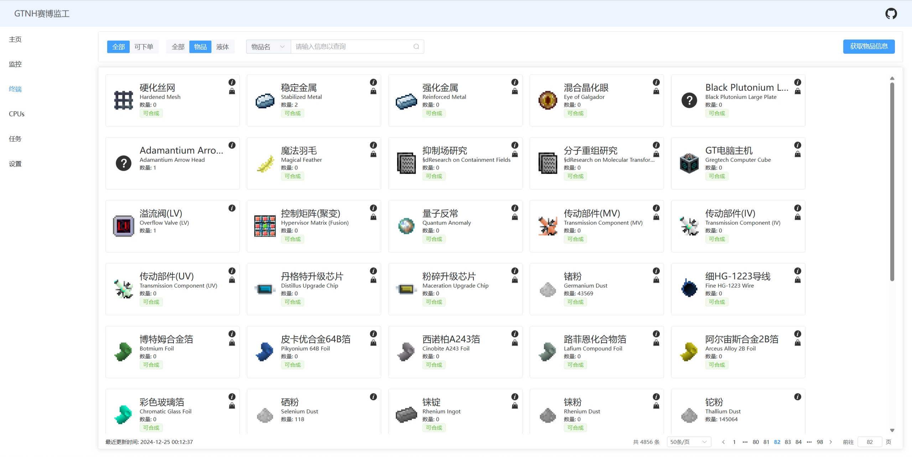

  
  

<h1 align="center" style="font-size: 38px;">RemoteOC</h1>
<h3 align="center">AE2 Control for GTNH 2.6.0</h3>

> 当前项目正在开发中。

## 效果图

## 其他

### nbt标签解析

[https://github.com/sjmulder/nbt-js](https://github.com/sjmulder/nbt-js)

### 物品和流体图标、数据来源

[https://github.com/RealSilverMoon/nesql-exporter/](https://github.com/RealSilverMoon/nesql-exporter/)

